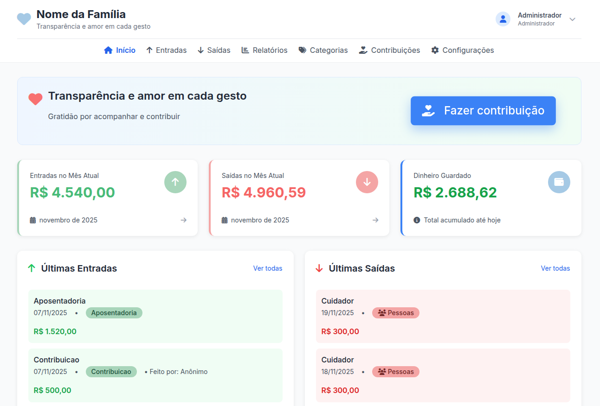
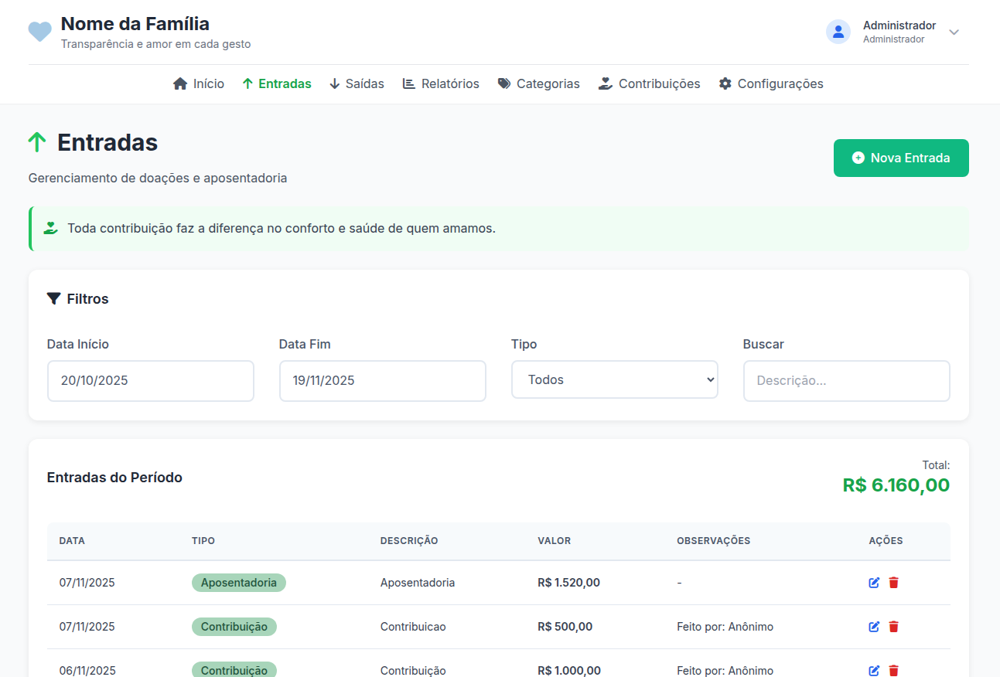
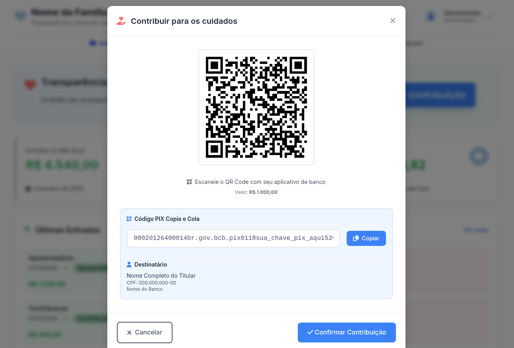
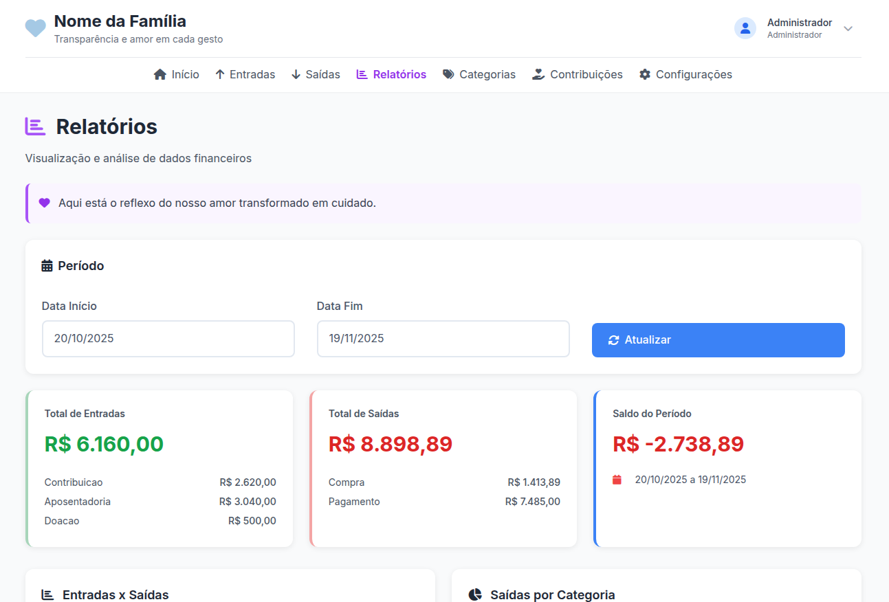

# 💙 Sistema de Prestação de Contas para Cuidadores

Sistema completo e transparente para gestão financeira de cuidados com pessoas em situação de vulnerabilidade (idosos, pessoas com Alzheimer, deficiências, etc.).

[](LICENSE)
[](https://www.php.net/)
[](https://www.mysql.com/)

## 📋 Sobre

Desenvolvi este sistema para minha própria família, para gerenciar os cuidados da minha mãe que tem Alzheimer. Precisávamos de transparência total nas finanças e facilitar contribuições da família. Agora compartilho com outras famílias que possam estar na mesma situação.

## 📸 Screenshots

### Dashboard Principal


_Visão geral com resumo financeiro, últimas movimentações e acesso rápido_

### Gestão de Entradas


_Registro e acompanhamento de receitas (aposentadoria, contribuições, doações)_

### Sistema de Contribuições PIX


_Geração de QR Code e código Copia e Cola para facilitar doações_

### Relatórios com Gráficos


_Visualização mensal e anual de receitas e despesas com resumos detalhados_

## ✨ Funcionalidades

- **Gestão Financeira Completa**

  - Registro de entradas (aposentadoria, contribuições, doações)
  - Registro de saídas (medicamentos, consultas, fraldas, cuidadores)
  - Categorização de despesas
  - Relatórios mensais e anuais com gráficos

- **Sistema de Contribuições**

  - PIX dinâmico com QR Code
  - Contribuições anônimas ou identificadas
  - Aprovação de contribuições pelo admin

- **Controle de Acesso**

  - Admin: controle total
  - Convidados: acesso somente leitura via link único
  - Visitantes: podem visualizar e contribuir

- **Segurança**
  - Autenticação com sessão
  - Proteção CSRF
  - Senhas com bcrypt
  - Links temporários para convidados

## 🚀 Instalação

### Requisitos

- PHP 7.4+
- MySQL 5.7+
- Apache ou Nginx
- Node.js 14+ (para Tailwind CSS)

### Passos

```bash
# 1. Clone o repositório
git clone https://github.com/oridestomkiel/sistema-prestacao-contas.git
cd sistema-prestacao-contas

# 2. Configure o ambiente
cp .env.example .env
nano .env  # Configure suas credenciais

# 3. Crie o banco de dados
mysql -u root -p -e "CREATE DATABASE prestacao_contas CHARACTER SET utf8mb4 COLLATE utf8mb4_unicode_ci;"
mysql -u root -p prestacao_contas < db/schema.sql

# 4. Instale dependências e compile CSS
npm install
npm run build

# 5. Configure permissões
chmod 600 .env
chmod 755 -R public/
mkdir -p public/uploads public/comprovantes storage/logs
chmod 775 public/uploads public/comprovantes storage/logs

# 6. Configure seu servidor web (Apache/Nginx) apontando para /public
```

### Configuração do .env

```env
# Banco de Dados
DB_HOST=localhost
DB_NAME=prestacao_contas
DB_USER=seu_usuario
DB_PASS=sua_senha

# Admin
ADMIN_EMAIL=seu@email.com
ADMIN_PASS_DEFAULT=SuaSenhaForte123

# PIX (para contribuições)
PIX_CHAVE=sua_chave_pix
PIX_NOME=Nome do Beneficiário
PIX_HOLDER_NAME=Nome Completo
PIX_CPF_DISPLAY=000.000.000-00
PIX_BANK_NAME=Nome do Banco

# Identidade
PATIENT_NAME=Nome da Pessoa Cuidada
PATIENT_TITLE=Mãe/Vó/Bisavó
ORGANIZATION_NAME=Nome da Família
```

### Primeiro Acesso

1. Acesse seu domínio
2. Login: email e senha definidos no `.env`
3. **Importante**: Altere a senha em Configurações!

## 🛠️ Tecnologias

- **Backend**: PHP (vanilla)
- **Banco**: MySQL
- **Frontend**: Tailwind CSS 3.x, Alpine.js 3.x
- **Gráficos**: Chart.js
- **Build**: Node.js + npm

## 📁 Estrutura

```
├── public/          # Web root
│   ├── api/        # APIs REST
│   ├── assets/     # CSS, JS
│   └── includes/   # Header, footer
├── src/            # Código fonte
│   ├── config/     # Configurações
│   ├── models/     # Modelos
│   ├── middleware/ # Auth, CSRF
│   └── helpers/    # Funções
├── db/
│   └── schema.sql  # Schema do banco
├── .env            # Suas configurações (não commitado)
├── .env.example    # Template
└── package.json
```

## 📖 Uso

### Criar Link para Convidados

1. Acesse "Configurações" → "Tokens de Acesso"
2. Crie um novo token
3. Defina nome e prazo de validade
4. Compartilhe o link

### Receber Contribuições via PIX

1. Configure PIX no `.env`
2. No dashboard: "Contribuir"
3. Gere QR Code ou código Copia e Cola
4. Confirme contribuição em "Contribuições Pendentes"

## 🔐 Servidor Web

### Apache

```apache
<VirtualHost *:80>
    ServerName seu-dominio.com
    DocumentRoot /caminho/para/public

    <Directory /caminho/para/public>
        AllowOverride All
        Require all granted
    </Directory>
</VirtualHost>
```

### Nginx

```nginx
server {
    listen 80;
    server_name seu-dominio.com;
    root /caminho/para/public;
    index index.php;

    location ~ \.php$ {
        fastcgi_pass unix:/var/run/php/php7.4-fpm.sock;
        fastcgi_param SCRIPT_FILENAME $document_root$fastcgi_script_name;
        include fastcgi_params;
    }

    location / {
        try_files $uri $uri/ /index.php?$query_string;
    }
}
```

## 🤝 Contribuindo

Contribuições são bem-vindas! Este projeto foi feito para ajudar famílias.

1. Fork o projeto
2. Crie uma branch (`git checkout -b feature/MinhaFeature`)
3. Commit (`git commit -m 'Adiciona MinhaFeature'`)
4. Push (`git push origin feature/MinhaFeature`)
5. Abra um Pull Request

## 📝 Licença

MIT License - veja [LICENSE](LICENSE)

## 💬 Suporte

Se você está usando este sistema para cuidar de alguém que ama, meu coração está com você. ❤️

- **Issues**: Use as Issues do GitHub para reportar bugs ou sugerir melhorias
- **Discussões**: Use Discussions para perguntas e compartilhar experiências

## 🙏 Agradecimentos

A todas as famílias que cuidam com amor de seus entes queridos.

---

**Feito com ❤️ por alguém que entende o peso e a honra de cuidar**
